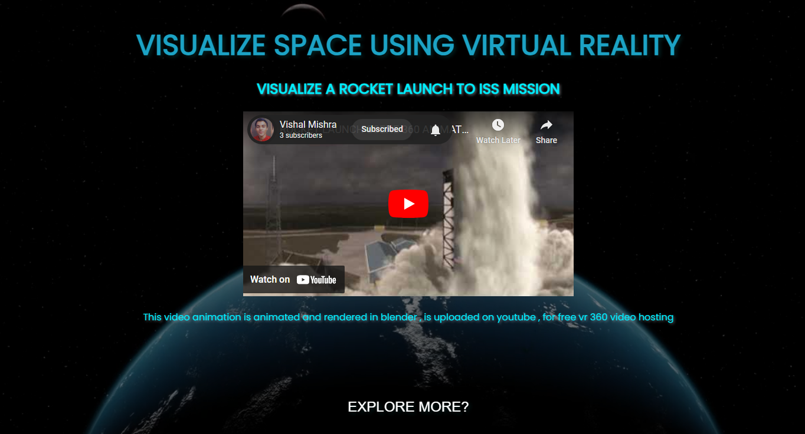
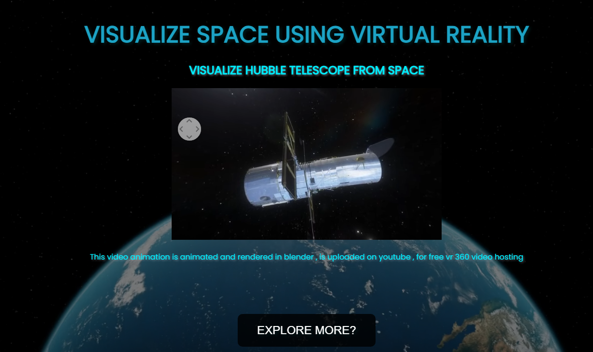
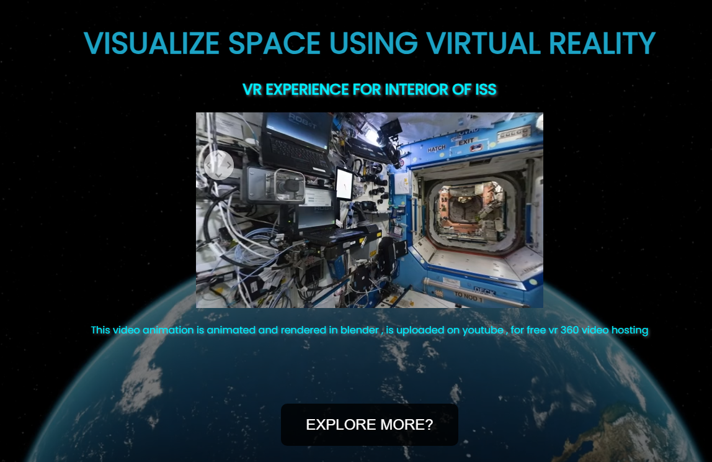

## VR Visualization Experience Readme
Overview
Welcome to our immersive VR Visualization Experience! This project combines the power of 3D animations created in Blender, imported models from Sketchfab, and AI-driven audio to provide a captivating journey through three extraordinary missions: Crew Dragon Launch, Life of the Hubble Telescope, and Interior of the International Space Station (ISS). The content is tailored to cater to the curiosity of school kids and astronomy enthusiasts, offering a detailed exploration of each mission.

## Features
- Blender 3D Animations:

Engaging 3D animations crafted in Blender bring the missions to life.
Attention to detail ensures an authentic and visually stunning experience.
- Sketchfab Integration:

Models imported from Sketchfab enhance the realism of the scenes.
High-quality assets contribute to the overall immersive feel of the VR environment.
AI-Enhanced Audio Narration:

Detailed knowledge about each mission is provided through AI-generated audio.
Users can explore the missions while listening to informative and engaging commentary.
- 360° Animated Videos on YouTube:

Uploaded 360° animated videos on YouTube for an accessible and free viewing experience.
Users can enjoy the immersive content without any cost, making it ideal for educational purposes.
- Responsive Webpage:

A responsive webpage ensures accessibility across various devices.
Optimized for seamless navigation and an enjoyable user experience.
- Mission-Specific Buttons:

   - Crew Dragon Launch: Experience the thrilling launch of the Crew Dragon spacecraft as it embarks on its space journey.
   - Life of the Hubble Telescope: Dive into the captivating journey of the Hubble Telescope, showcasing its impactful              discoveries      and contributions to astronomy.
   -  Interior of the International Space Station (ISS): Explore the living and working spaces of astronauts aboard the ISS, gaining insight into life beyond Earth.
   
On the homepage, find three buttons specifying the missions.
Click on the desired mission to start the VR experience.
- Immerse Yourself:

Navigate through the VR environment using your preferred VR headset or device.
Enjoy the 360° animated videos, AI-driven audio narration, and detailed scenes.
System Requirements
VR Headset (Optional)
Compatible Web Browser
Internet Connection
Credits
3D Animations: [Your Name/Team]
Sketchfab Models: [Sketchfab Contributors]
AI Audio: [AI Audio Technology/Provider]
360° Animated Videos: [YouTube Channel]
Webpage Development: [Web Developer/Team]
Feedback
We value your feedback! If you encounter any issues, have suggestions, or simply want to share your experience, please reach out to us at [shindevinayak233@email.com].

Thank you for exploring the wonders of space with our VR Visualization Experience!

screenshots
   - 
   - 
   - 
   - 
   - 
